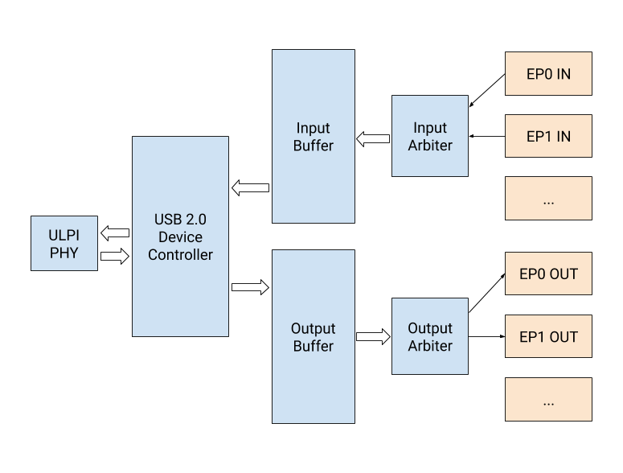
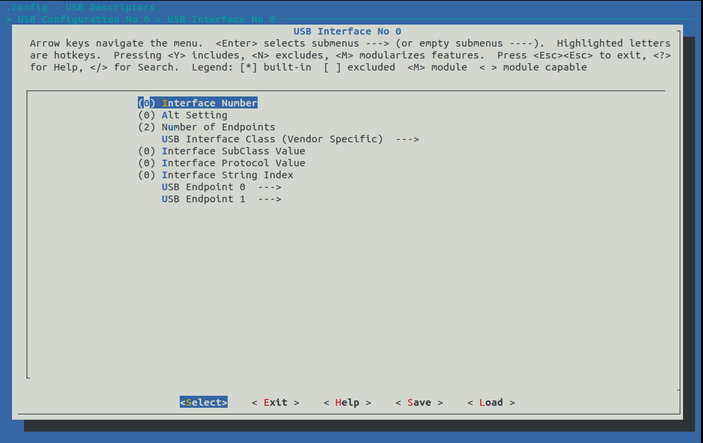

# lambdaUSB

## A configurable USB 2.0 device core using [nMigen](https://github.com/m-labs/nmigen)

**lambdaUSB is still in an experimental stage and is therefore incomplete. The user-facing API may change before reaching stability.**



### Features

* High Speed USB
* up to 32 endpoints (16 inputs, 16 outputs)
* double buffering, per endpoint

### Installation

Download and install lambdaUSB:

    git clone https://github.com/lambdaconcept/lambdaUSB
    cd lambdaUSB
    python3 setup.py develop --user

### Usage

1. Instantiate the USB device:

```python
m.submodules.ulpi_phy = ulpi_phy = ULPIPhy(platform.request("ulpi", 0))
m.submodules.usb_dev  = usb_dev  = USBDevice(ulpi_phy)
```

For the moment, only ULPI transceivers such as the USB3300 are supported.

2. Request endpoint ports:

```python
ep1_in  = usb_dev.input_port(0x1, 512, Transfer.BULK)
ep1_out = usb_dev.output_port(0x1, 512, Transfer.BULK)
```

3. Connect the endpoint ports to your design:

```python
m.d.comb += [
  my_endpoint.source.connect(ep1_in),
  ep1_out.connect(my_endpoint.sink)
]
```

For a full example, have a look at `examples/blinker`.

### Device configuration

For convenience, we provide a configuration endpoint at `lambdausb/cfg.py`.
It stores the configuration descriptors in a ROM, and responds to host requests on endpoint 0.

To use it, you must first generate a config file:
```
cd tools/genconfig
make
```

You will be presented a menuconfig interface from which you can setup your USB device:



The output `config.py` file can be imported and used like so:

```python
from lambdausb.cfg import ConfigurationEndpoint
from config import descriptor_map, rom_init

m.submodules.cfg_ep = cfg_ep = ConfigurationEndpoint(descriptor_map, rom_init)
cfg_in  = usb_dev.input_port(0x0, 64, Transfer.CONTROL)
cfg_out = usb_dev.output_port(0x0, 64, Transfer.CONTROL)

m.d.comb += [
    cfg_ep.source.connect(cfg_in),
    cfg_out.connect(cfg_ep.sink)
]
```

### License

lambdaUSB is released under the two-clause BSD license.
